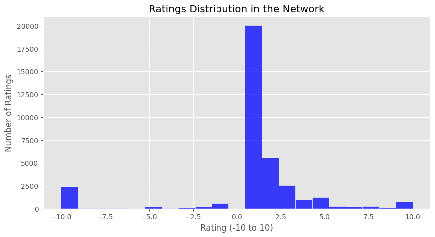
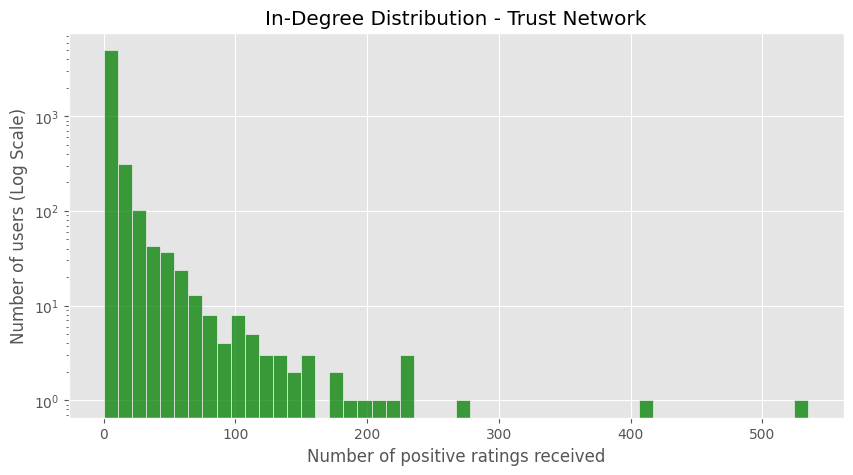
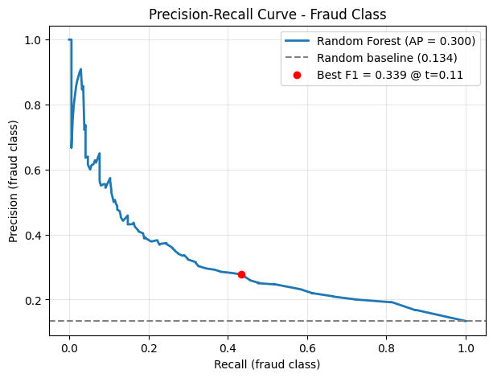

# דו"ח מסכם: ניתוח רשתות אמון וזיהוי הונאות ב-Bitcoin OTC

**מגישים:**
1. נבו יפלח 211433339
2. ליאל ירדני 211339098
3. אילן קוזוקרו 206699050

**קוד המקור (Jupyter Notebook):** https://github.com/nevoiflah/Bitcoin-Trust-Network-Analysis

---

## 1. מבוא / מוטיבציה / הגדרת הבעיה

### הקשר ורקע

המסחר בביטקוין מאופיין באנונימיות מוחלטת: כל משתמש מזוהה רק לפי כתובת ארנק קריפטוגרפית, ללא שם אמיתי, כתובת, או כל פרט מזהה אחר. בסביבת מסחר P2P (עמית לעמית), שבה מוכר ורוכש נפגשים ישירות להעברת מטבעות, היעדר הזהות יוצר בעיית אמון קרדינלית: כיצד ניתן לדעת שהצד השני אינו נוכל?

פלטפורמת Bitcoin OTC (Over-The-Counter) נוצרה כדי לפתור בעיה זו באמצעות מנגנון "רשת אמון" (Web of Trust). לאחר כל עסקה, המשתמשים מדרגים אחד את השני על סקלה של 10- עד +10, כאשר הדירוג שלילי מעיד על עסקה כושלת או הונאה. לאורך זמן, נצברים דירוגים שיוצרים מוניטין, ומשתמש עם ציון גבוה נחשב לאמין.

### הבעיה: התקפות Sybil

עם זאת, רשת זו חשופה לסוג מתוחכם של מתקפה המכונה **Sybil Attack**: נוכלים מייצרים קהילות של מספר חשבונות פיקטיביים, מדרגים אחד את השני דירוגים חיוביים גבוהים כדי לצבור מוניטין מזויף במהירות, ולאחר מכן "עוקצים" משתמשים תמימים שסמכו על הציון הגבוה. הנזק יכול לנוע מגניבת מאות דולרים בעסקה בודדת ועד לאלפי דולרים בסכימת הונאה מתמשכת.

### מטרת הפרויקט

מטרת הפרויקט היא לנתח את מאגר הנתונים של Bitcoin OTC באמצעות כלים מתורת הגרפים ולמידת מכונה על מנת:
1. **לזהות נוכלים בולטים** - משתמשים שספגו כמות חריגה של דירוגים שליליים.
2. **לאתר קהילות זדוניות** - קבוצות המדרגות אחת את השנייה חיובית בעוד שמשתמשים חיצוניים אמינים מדרגים אותן שלילית.
3. **לחזות עסקאות עתידיות** - האם אינטראקציה עתידית בין שני משתמשים צפויה להיות אמינה או הונאה, בהתבסס אך ורק על מבנה הרשת ההיסטורי.

---

## 2. עבודה קשורה (Related Work)

### Kumar et al. (2016) - Edge Weight Prediction in Weighted Signed Networks

עבודה זו הניחה את היסודות לניתוח **רשתות חתומות** (Signed Networks), שבהן קשתות יכולות להיות חיוביות (אמון) או שליליות (חוסר-אמון). המחברים ניתחו את Bitcoin OTC ורשת Alpha דומה, והראו שרשתות חתומות מציגות מאפיינים מבניים שונים לחלוטין מרשתות חברתיות רגילות: ספקטרום הסנטרליות מוטה, ומשתמשים זדוניים נוטים להתקבץ יחד בדפוס שאינו מקרי. הממצא המרכזי הרלוונטי לפרויקטנו הוא שניתן להבחין בין "גרעין אמין" לבין "ספֶרה זדונית" כבר ברמת מדדי הדרגות הבסיסיים.

**רלוונטיות:** הפרויקט שלנו בנוי ישירות על הרעיון של פיצול הגרף לרשת-אמון ורשת-חוסר-אמון ויישום מדדים ייעודיים על כל אחת מהן.

### Leskovec et al. (2010) - Signed Networks in Social Media

עבודה זו הציגה את **תיאוריית האיזון המבני** (Structural Balance Theory) ויישמה אותה לחיזוי סוג הקשר (חיובי/שלילי) בין שני משתמשים. המחברים הראו שמשולשים "לא מאוזנים" (לדוגמה, שני ידידים עם אויב משותף שאינם אויבים זה לזה) נדירים בפועל ולכן ניתן להשתמש בנוכחותם כמאפיין חזק לחיזוי.

**רלוונטיות:** מדד "שכנים משותפים" (Common Neighbors) ששימש כמאפיין במודל החיזוי שלנו מבוסס על הרעיון של מבנה משולשים. בנוסף, הסיווג לאמין/לא-אמין שביצענו מהווה הרחבה ישירה של שיטות החיזוי שתוארו שם.

### תרומת הפרויקט הנוכחי

הפרויקט שלנו מהווה **הרחבה** על שתי העבודות הנ"ל בשני ממדים: ראשית, שילוב אלגוריתם זיהוי קהילות (Louvain) כשלב מקדים לחשיפת התארגנויות Sybil, שהוא ממד שלא נחקר לעומק בעבודות הנ"ל. שנית, יישום **פיצול כרונולוגי** (ולא אקראי) ל-Train/Test, המדמה תרחיש מציאותי שבו הנתונים ההיסטוריים בלבד משמשים לחיזוי עסקאות עתידיות - גישה חשובה למניעת דליפת נתונים שאינה מיושמת בעבודות הבסיסיות.

---

## 3. תיאור מסד הנתונים

### מקור הנתונים

הנתונים נלקחו מאוסף **Stanford SNAP** (Stanford Network Analysis Project), שהוא מאגר סטנדרטי ומוכר לניתוח רשתות גרפיות. הקובץ `soc-sign-bitcoinotc.csv.gz` מכיל את כל הדירוגים שנרשמו בפלטפורמת Bitcoin OTC מאז הקמתה.

הנתונים נטענים ישירות בקוד מהכתובת של Stanford SNAP ללא צורך בהורדה מקומית, בהתאם לדרישות הפרויקט.

### מבנה הנתונים

כל רשומה מייצגת דירוג יחיד ומכילה ארבעה שדות:

| עמודה | תיאור |
|---|---|
| `SOURCE` | מזהה המשתמש המדרג |
| `TARGET` | מזהה המשתמש המדורג |
| `RATING` | הדירוג שניתן (10- עד +10) |
| `TIME` | חותמת זמן Unix של הדירוג |

### סטטיסטיקות בסיסיות

לאחר טעינת הנתונים:
- **סך הדירוגים (קשתות):** 35,592
- **סך המשתמשים (צמתים):** 5,881
- **קשתות חיוביות (Trust Network):** 32,029 (כ-90%)
- **קשתות שליליות (Distrust Network):** 3,563 (כ-10%)

ניתן לראות שרוב מוחלט מהדירוגים הם חיוביים, אך הדירוגים השליליים - 10% לכאורה - מרוכזים מאוד סביב מספר קטן של צמתים, כפי שתוצאות ה-EDA מגלות.

---

## 4. מודל / אלגוריתמים / שיטה

### 4.1 בניית הגרף ופיצולו

השלב הראשון הוא בניית **גרף מכוון ושקול** (Directed Weighted Graph) מהנתונים הגולמיים באמצעות ספריית NetworkX. הגרף מכוון מכיוון שדירוג הוא פעולה חד-כיוונית (A מדרג את B אינו זהה ל-B מדרג את A), ושקול מכיוון שלכל קשת ערך מספרי (הדירוג עצמו).

לאחר מכן פיצלנו את הגרף לשני תת-גרפים:
- **G_trust** - מכיל רק קשתות עם דירוג חיובי (RATING > 0). זוהי רשת האמון.
- **G_distrust** - מכיל רק קשתות עם דירוג שלילי (RATING < 0). זוהי רשת חוסר-האמון.

פיצול זה מאפשר לנו להפעיל מדדים שונים ומותאמים על כל רשת בנפרד.

### 4.2 מדדי סנטרליות: PageRank ו-In-Degree משוקלל

#### PageRank על רשת האמון

**PageRank** הוא אלגוריתם איטרטיבי המחשב את "הסמכות" של כל צומת בגרף מכוון. הרעיון: צומת מקבל ציון גבוה יותר אם הוא מקבל קשתות ממשתמשים שגם להם ציון גבוה. בהקשר של Bitcoin OTC, זה מוצא את המשתמשים שנחשבים לאמינים לא רק לפי כמות הדירוגים שקיבלו, אלא לפי **איכות** מדרגיהם - מי שמשתמשים מהימנים בעצמם מייחסים להם אמון.

PageRank מתאים במיוחד לגרף זה מכיוון שנוכל שהצליח לצבור דירוגים חיוביים מתוך קהילה פנימית לא יקבל ציון PageRank גבוה, שכן המשתמשים בתוך קהילתו אינם עצמם בעלי PageRank גבוה.

#### In-Degree משוקלל על רשת חוסר-האמון

על רשת חוסר-האמון השתמשנו במדד פשוט אך יעיל: **סכום הדירוגים השליליים** שכל צומת ספג (In-Degree משוקלל). כלומר, לא סתם כמה פעמים קיבל דירוג שלילי, אלא מה **עוצמת** חוסר-האמון הכולל שספג. זה מאפשר לזהות נוכלים שביצעו הונאות חוזרות בעצמות שונות.

### 4.3 זיהוי קהילות: אלגוריתם Louvain

**אלגוריתם Louvain** הוא שיטה לזיהוי קהילות בגרפים המבוססת על **מקסימום מודולריות** (Modularity Maximization). הרעיון הבסיסי: מודולריות מודדת עד כמה הגרף צפוף יותר בתוך הקהילות לעומת מה שהיינו מצפים מגרף אקראי עם אותם מאפיינים. האלגוריתם עובד בשני שלבים שחוזרים על עצמם: ראשית הקצאת כל צומת לקהילה שמקסימלת את המודולריות המקומית, ולאחר מכן איחוד קהילות לצמתים "על" ומעבר לשלב הבא.

הרצנו את Louvain על הגרסה הלא-מכוונת של G_trust (מכיוון ש-Louvain עובד על גרפים לא-מכוונים), עם ערך רזולוציה סטנדרטי של 1.0.

לאחר קבלת הקהילות, בנינו **מנגנון סריקה לזיהוי קהילות זדוניות**: עבור כל קהילה, סכמנו את עוצמת הדירוגים השליליים שספגה ממשתמשים **מחוץ** לאותה קהילה (External Distrust). חישבנו את היחס בין עוצמה זו לגודל הקהילה - יחס גבוה מצביע על קהילה שהאינטרנט-הכלל רואה כבלתי-אמינה, בעוד שחברי הקהילה עצמה מדרגים זה את זה חיובית.

### 4.4 חיזוי קשרים (Link Prediction) עם Random Forest

#### אסטרטגיית הפיצול

חיזוי הקשרים מחייב זהירות מיוחדת בנוגע ל**דליפת נתונים** (Data Leakage). אם נשתמש בנתונים עתידיים לאימון המודל, לא נוכל לדעת אם הוא מדויק מפני שלמד לנבא, או מפני שה"עתיד" כבר היה בנתוני האימון.

לכן ביצענו **פיצול כרונולוגי**: כל הדירוגים לפני ינואר 2014 שמשו כסט אימון, וכל הדירוגים מינואר 2014 ואילך שמשו כסט בדיקה. גרף האימון נבנה **אך ורק** מהנתונים ההיסטוריים, ומדדי הסנטרליות (PageRank, דרגות) חושבו על גרף זה בלבד - מה שמבטיח שהמודל אינו "רואה" מידע עתידי.

#### חילוץ מאפיינים (Feature Extraction)

עבור כל זוג משתמשים (SOURCE, TARGET) בסט הבדיקה, חילצנו חמישה מאפיינים מבניים מגרף האימון:

| מאפיין | הסבר |
|---|---|
| PageRank של SOURCE | מידת האמינות של המשתמש המדרג לפי הרשת ההיסטורית |
| PageRank של TARGET | מידת האמינות של המשתמש המדורג לפי הרשת ההיסטורית |
| Common Neighbors | מספר השכנים המשותפים - מדד לקרבה חברתית בלתי-תלויה בקשר הישיר |
| In-Degree של TARGET | כמה דירוגים קיבל בעבר - מדד ל"ניסיון" שלו |
| Out-Degree של SOURCE | כמה דירוגים נתן בעבר - מדד לפעילותו |

#### מודל הסיווג

אימנו מודל **Random Forest** (יער אקראי) עם 100 עצי החלטה ו-`class_weight='balanced'` כדי לטפל בחוסר האיזון בין מחלקות (90% חיובי, 10% שלילי). תווית כל דוגמה היא 1 (אמין) אם הדירוג חיובי, ו-0 (הונאה) אם הדירוג שלילי.

---

## 5. תוצאות וממצאים

### 5.1 ניתוח חקרני (EDA)

ניתוח התפלגות הדירוגים חשף דפוס א-סימטרי מובהק: הדירוגים מרוכזים בעיקר בערכים חיוביים **נמוכים** - הציונים +1 ו-+2 לבדם מהווים 72% מכלל הדירוגים - בעוד שדירוגים קיצוניים נדירים יחסית (רק 10.2% מהדירוגים הם בעוצמה 8 ומעלה). ממצא מעניין נוסף: הציון 10- שכיח יותר (6.8%) מהציון +10 (2.1%). כלומר, משתמשים מעניקים אמון בזהירות ובמינון נמוך, אך כאשר הם מזהים הונאה הם נוטים להעניק דווקא את הציון השלילי המרבי. אסימטריה זו מחזקת את ההנחה שדירוג שלילי חזק הוא אות אמין להונאה, ומצדיקה את הפרדת הגרף לרשת-אמון ולרשת-חוסר-אמון.

*תרשים 1: התפלגות הדירוגים בסקלה 10- עד +10. הריכוז בערכים +1 ו-+2 בולט לעין.*

התפלגות ה-In-Degree ברשת האמון מציגה **חוק חזקה** (Power Law): החציון עומד על 2 דירוגים חיוביים בלבד למשתמש, 80.4% מהמשתמשים קיבלו 5 דירוגים חיוביים או פחות, ואילו אחוזון עליון בודד של משתמשים מרכז 23.3% מכלל הדירוגים החיוביים (המשתמש המוביל קיבל 535 דירוגים). זהו מאפיין אופייני לרשתות חברתיות אמיתיות, ומשמעותו המעשית היא שלרוב המשתמשים אין היסטוריה מספקת לביסוס מוניטין - מה שמותיר מרחב פעולה נרחב לנוכלים.

*תרשים 2: התפלגות ה-In-Degree ברשת האמון (ציר Y לוגריתמי). הזנב הארוך מעיד על חוק חזקה.*

### 5.2 מדדי סנטרליות: מי הם השחקנים המרכזיים?

#### המשתמשים האמינים ביותר (PageRank על רשת האמון)

| דירוג | מזהה משתמש | ציון PageRank |
|---|---|---|
| 1 | 35 | 0.0161 |
| 2 | 2642 | 0.0135 |
| 3 | 1 | 0.0091 |
| 4 | 7 | 0.0088 |
| 5 | 1810 | 0.0076 |

משתמש 35 ומשתמש 2642 בולטים כ"עמודי השדרה" האמינים של הפלטפורמה - הם מהווים את המשתמשים ש**אחרים** אמינים מייחסים להם אמון, ולכן הם מהווים נקודות עוגן לאמינות הפלטפורמה כולה.

#### הנוכלים הבולטים ביותר (In-Degree שלילי משוקלל)

| דירוג | מזהה משתמש | סך דירוגים שליליים |
|---|---|---|
| 1 | 3744 | -725 |
| 2 | 1810 | -385 |
| 3 | 2028 | -342 |
| 4 | 1383 | -338 |
| 5 | 2498 | -296 |

ממצא מעניין: משתמש 1810 מופיע גם ברשימת המהימנים (PageRank גבוה) וגם ברשימת הנוכלים (דירוג שלילי גבוה). ממצא זה עשוי להצביע על אחד מהבאים: (א) פרופיל "מוניטין גבוה" שנוצל לביצוע הונאות לאחר שצבר אמון, (ב) יריבות מסחרית שגרמה לדירוגים שליליים על-ידי מתחרים, (ג) חשבון שנפרץ ושימש לפעילות זדונית.

### 5.3 זיהוי קהילות וגילוי התארגנויות Sybil

אלגוריתם Louvain זיהה **42 קהילות** ברשת האמון, כאשר חמש הגדולות מונות 875, 858, 773, 533 ו-523 חברים. הטבלה הבאה מציגה את חמש הקהילות החשודות ביותר לפי **יחס חוסר-אמון חיצוני לגודל הקהילה**, מבין 20 הקהילות הגדולות שנסרקו:

| קהילה | גודל | סך דירוגים שליליים חיצוניים | יחס (ל-1 חבר) |
|---|---|---|---|
| #15 | 32 | 4,365 | **136.41** |
| #12 | 64 | 1,772 | 27.69 |
| #10 | 76 | 1,710 | 22.50 |
| #18 | 16 | 189 | 11.81 |
| #17 | 16 | 101 | 6.31 |

**קהילה #15 היא ממצא קריטי:** 32 משתמשים בלבד ספגו דירוגים שליליים בעוצמה כוללת של 4,365 ממשתמשים מחוץ לקהילה - יחס של 136 יחידות חוסר-אמון לכל חבר קהילה. זהו דפוס קלאסי של **התקפת Sybil**: הקהילה מדרגת את עצמה חיובית פנימית, אך שאר הרשת מזהה אותה כמקור הונאה ומדרגת אותה שלילית בעוצמה רבה.

### 5.4 חיזוי קשרים: ביצועי המודל

#### גודל סטי הנתונים

לאחר הפיצול הכרונולוגי (ינואר 2014) התקבלו 30,314 דירוגים בסט האימון ו-5,278 בסט הבדיקה. מתוך סט הבדיקה, 2,529 זוגות שבהם שני המשתמשים הופיעו כבר בגרף האימון (כך שניתן לחשב עבורם מאפיינים מבניים) שימשו להערכת המודל, מתוכם 338 קשתות הונאה ו-2,191 קשתות אמון.

#### תוצאות

המודל השיג ביצועים טובים בזיהוי עסקאות אמינות (מחלקה חיובית), מה שמאשש שמדדים מבניים בלבד מספיקים לחיזוי: Precision = 0.87, Recall = 0.99, F1 = 0.93, ובסך הכל Accuracy = 0.87. בזיהוי ההונאה (מחלקה שלילית) בסף ההחלטה המובנה (0.5) ה-Recall עומד על 0.07 בלבד (Precision = 0.64, F1 = 0.13).

עם זאת, ניתוח סף ההחלטה מראה שאין מדובר בהיעדר אות: איכות הדירוג שהמודל מייצר היא Average Precision = 0.30 מול קו בסיס אקראי של 0.134 (פי 2.2) ו-ROC-AUC = 0.70. הכשל הוא בסף הקבוע ולא במודל - `class_weight='balanced'` משנה את קריטריון הפיצול בתוך העצים אך אינו מזיז את סף 0.5, והורדת הסף ל-0.11 מעלה את ה-Recall על ההונאה מ-0.07 ל-0.44 ואת ה-F1 מ-0.13 ל-0.34, ללא אימון מחדש וללא מאפיינים נוספים.

| מחלקה | Precision | Recall | F1 | תמיכה |
|---|---|---|---|---|
| Trust - אמין (חיובי) | 0.87 | 0.99 | 0.93 | 2,191 |
| Distrust - הונאה (סף 0.5) | 0.64 | 0.07 | 0.13 | 338 |
| **Distrust - הונאה (סף מכוונן 0.11)** | 0.28 | **0.44** | **0.34** | 338 |
| Accuracy כללית | - | - | 0.87 | 2,529 |

*תרשים 3: עקומת Precision-Recall עבור מחלקת ההונאה. הקו המקוטע הוא קו הבסיס האקראי (0.134); הנקודה מסמנת את נקודת ה-F1 המקסימלי (סף 0.11).*

מכאן שנכון לבחון את המודל כמנגנון דירוג בעל נקודת עבודה מתכווננת, שבה פלטפורמה אמיתית תבחר את הסף לפי היחס בין עלות הונאה שלא זוהתה לעלות האשמה שגויה.

**מסקנת הניסוי:** ניתן לחזות אמינות עסקה עתידית בין שני משתמשים אנונימיים לחלוטין ושטרם ניפגשו, **אך ורק** על סמך היכרות עם מבנה הרשת ההיסטורי - ללא שום מידע ישיר על הזהות שלהם.

---

## 6. קשיים ואתגרים

### חוסר איזון במחלקות

הפער הגדול בין דירוגים חיוביים (90%) ושליליים (10%) מוביל למודלי סיווג שמעדיפים מחלקה חיובית. `class_weight='balanced'` לבדו אינו מספיק, שכן הוא אינו מזיז את סף ההחלטה; הטיפול האפקטיבי היה כיוונון הסף (ראו 5.4). שיטות דגימה (כגון SMOTE) ומאפייני Structural Balance עשויים להניב שיפור נוסף באיכות הדירוג עצמה.

### הגדרת "ממצא חשוד" לעומת "נוכל ודאי"

הניתוח שלנו מבוסס על **אינדיקטורים** טופולוגיים ולא על אמת ידועה (Ground Truth). אין לנו תווית בינארית "נוכל/לא-נוכל" לכל משתמש, ולכן הממצאים על קהילות חשודות הם **הצבעה על חשד גבוה** ולא הוכחה חד-משמעית.

### פיצול כרונולוגי לעומת אקראי

הפיצול הכרונולוגי הביא לאתגר נוסף: צמתים שהופיעו לראשונה אחרי ינואר 2014 אינם קיימים בגרף האימון ולכן לא ניתן לחשב עליהם מאפיינים. סיננו אותם מהסט, מה שמקטין את גודל הסט אך מחזק את תקפות הניסוי.

---

## 7. מסקנות

ניתוח זה ממחיש את **עוצמתם של אלגוריתמים בגרפים** בתחום הסייבר הפיננסי. הראינו שניתן להפריד ביעילות בין פעילות לגיטימית לפעילות זדונית, אפילו ברשת אנונימית לחלוטין, **אך ורק על-ידי בחינת טופולוגיית האינטראקציות**.

שלושת הממצאים העיקריים:

1. **Sybil Attack ניתן לזיהוי** - קהילה #15 עם יחס של 136 יחידות חוסר-אמון חיצוני לחבר מהווה אינדיקטור חזק מאוד לפעילות מתואמת זדונית. קיומן של קהילות כאלה אושש מבחינה כמותית.

2. **PageRank עדיף על In-Degree פשוט** - זיהוי "גרעין אמון" מבוסס על איכות הקשרים ולא רק כמותם חשוב במיוחד ברשתות שבהן ניתן "לקנות" דירוגים בתוך קהילה.

3. **מבנה הרשת לבדו מספיק לחיזוי** - גם ללא מידע זהותי, ניתן לבנות מנגנון התרעה מוקדם על הונאות צפויות. זוהי תשתית ישימה לפלטפורמות מסחר P2P בזמן אמת.

### כיוונים לעבודה עתידית

- שילוב **Structural Balance Theory** ישיר כמאפיין (מספר משולשים מאוזנים/לא-מאוזנים) לשיפור מודל החיזוי.
- בחינת **Graph Neural Networks** (GNN) לסיווג צמתים כנוכל/לא-נוכל ישירות.
- ניתוח **אבולוציה זמנית** של הקהילות - האם קהילות חשודות גדלות בצורה חריגה לפני אירוע הונאה?

---

## 8. מקורות

1. S. Kumar, F. Spezzano, V.S. Subrahmanian, C. Faloutsos. **"Edge Weight Prediction in Weighted Signed Networks."** IEEE International Conference on Data Mining (ICDM), 2016. - המאמר שהציג את מאגרי Bitcoin OTC ו-Bitcoin Alpha וניתח את מבנה רשתות האמון החתומות.
2. J. Leskovec, D. Huttenlocher, J. Kleinberg. **"Signed Networks in Social Media."** ACM SIGCHI Conference on Human Factors in Computing Systems (CHI), 2010. - הצגת תיאוריית האיזון המבני (Structural Balance) וניתוח קשתות חיוביות ושליליות ברשתות חברתיות.
3. J. Leskovec, A. Krevl. **"SNAP Datasets: Stanford Large Network Dataset Collection."** http://snap.stanford.edu/data, 2014. - מקור מאגר הנתונים `soc-sign-bitcoinotc`.
4. **קוד המקור של הפרויקט:** https://github.com/nevoiflah/Bitcoin-Trust-Network-Analysis

---

## 9. תרומת חברי הצוות (חלוקת תפקידים)

העבודה בפרויקט זה בוצעה במשותף ובחלוקה שווה בין שלושת חברי הצוות. כל שלב - טעינת הנתונים והניתוח החקרני, מדדי המרכזיות, זיהוי הקהילות, מודל חיזוי הקשרים וכתיבת הדוח - נדון, תוכנן ויושם יחד, ולפיכך היקף התרומה של שלושתנו זהה. להלן חלוקת האחריות המובילה של כל אחד מחברי הצוות:

- **נבו יפלח:** טעינת הנתונים ועיבודם, הניתוח החקרני (EDA) וויזואליזציה של התפלגויות הרשת, חישוב מדדי המרכזיות (PageRank ו-In-Degree משוקלל), וכתיבת פרקי המבוא, המוטיבציה ותיאור מסד הנתונים.
- **ליאל ירדני:** פיתוח מודל חיזוי הקשרים - הפיצול הכרונולוגי למניעת דליפת נתונים, חילוץ המאפיינים המבניים מגרף האימון, אימון מסווג ה-Random Forest וניתוח הסף (Threshold Analysis), וכתיבת פרק התוצאות והממצאים.
- **אילן קוזוקרו:** יישום אלגוריתם Louvain לזיהוי קהילות, פיתוח הלוגיקה לאיתור קהילות זדוניות לפי יחס חוסר-האמון החיצוני, שילוב והערת הקוד במחברת ה-Jupyter, וכתיבת פרקי העבודה הקשורה והמסקנות.

שלושת חברי הצוות מצהירים כי היקף התרומה שלהם לפרויקט היה שווה, וכל אחד מהם מכיר את כלל חלקי העבודה ואת ההחלטות שהתקבלו בכל שלב.
